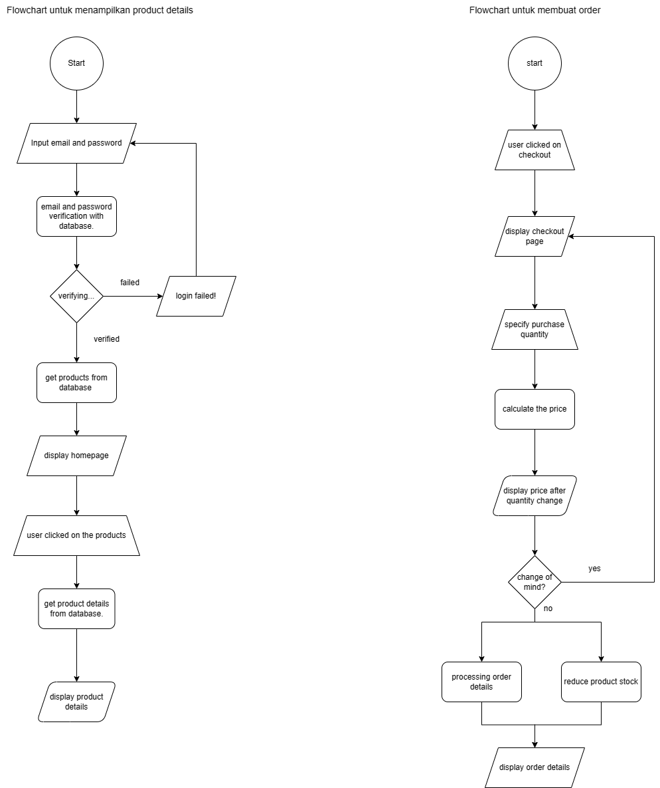
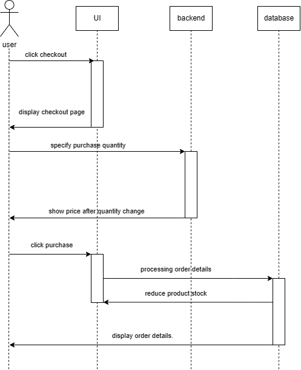

# E-Commerce Design Assignment

## High Level Design



Pada design ini, saya menggunakan Flowchart Diagram sebagai High Level Design karena dengan diagram ini kita dapat dengan mudah menjelaskan proses berjalannya suatu program. Diagram ini menjabarkan proses proses yang ada pada sebuah aplikasi yang diwakilkan dengan simbol simbol.

## Create Order Algorithm Design



```
function purchase() {
	if purchase successful{
		generate order details
	}else{
		order failed
	}
}

function price(){
	initialize quantity to 0
	if quantity more than 0 {
		calculate price after quantity change
	}else{
		do nothing
	}
}

function updateStock(){
	if purchase successful{
		reduce productStock based on quantity on purchase
		}
	}
```

## Complexity Analysis

Dari desain algoritma diatas dapat disimpulkan bahwa algroritma tersebut memiliki kompleksitas O(n^2). Hal ini dikarenakan pada function price() terdapat kondisi jika quantity lebih dari 0 akan menjalankan kode untuk menghitung harga berdasarkan perubahan quantity.
